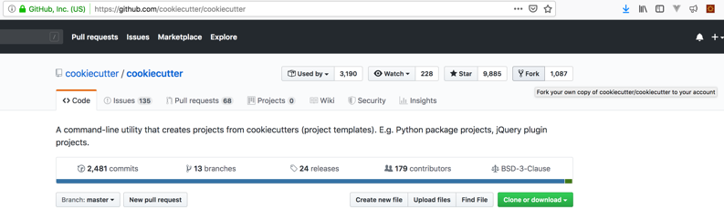
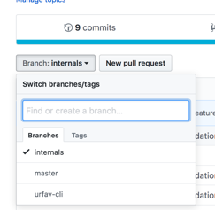
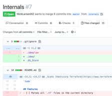
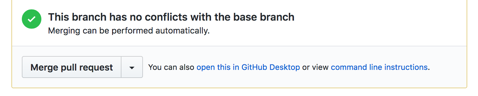

    1. Create a Github Account
    2. Fork a repository in Github (this is so there are existing files and history to learn from)
        


    3. Clone your forked repository from Github to your laptop

        ```bash
        git clone https://github.com/pflashgary/cookiecutter
        cd cookiecutter
        ```

    4. Look at the git history
        ```bash
        git log
        ```

    5. Make a branch in your local copy of that repository
        ```bash
        git checkout -b my-playground
        ```

    6. Modify some files in some way
    7. Look at the status. Notice the files changed in red
        ```bash
        git status
        ```

    8. Look at the differences
        ```bash
        git diff
        ```

    9. Stage one of the staged files
        ```bash
        git add <filename>
        ```

    10. Look at status again. Notice the file you staged in the previous command now shows green, while the rest are still red
        ```bash
        git status
        ```

    11. Look at the differences of only the staged file
        ```bash
        git diff --staged # If that doesn’t work use the older flag --cached
        ```

    12. Stage another file

    git add <filename>

    13. Create a new file with something in it
        ```bash
        echo "my new file" > newfile.txt
        ```

    14. Look at the status
        ```bash
        git status
        ```

    15. Stage all files. Generally avoid doing this and explicitly add the files you want to stage for a commit.
        ```bash
        git add .
        ```

    16. Make your first commit
        ```bash
        git commit -m "My very first commit"
        ```

    17. Look at the history
        ```bash
        git log
        git log -p # use space to scroll down, q to exit
        ```

    18. Compare your branch changes with the master branch (you should only see changes from the commit you made)
        ```bash
        git diff master
        ```

    19. Switch back to the master branch

        ```bash
        git checkout master
        ```

    20. Do you see the file you created?
        ```bash
        ls
        ```

    21. Look at the history
        ```bash
        git log
        ```

    22. Switch back to your branch
        ```bash
        git checkout my-playground
        ```

    23. Do you see the file you created now?
        ```bash
        ls
        ```

    24. Make some more changes
    25. Stage your changes
        ```bash
        git add <file1> <file2> <…>
        ```

    26. Ensure every change has been staged (should be no red)
        ```bash
        git status
        ```

    27. Make your second commit
        ```bash
        git commit -m "my second commit"
        ```

    28. Push your local commits back to Github (this will fail on the first go)
        ```bash
        git push
        ```

    29. Try again (after doing this once on a branch, you can revert back to    git push)
        ```bash
        git push --set-upstream origin my-playground
        ```

    30. Imagine someone makes changes on your branch in Github, sync any changes back to your local branch (there won’t be any, but it’s good practice to do this regularly)
        ```bash
        git pull
        ```
 

    31. View your changes on Github, select your branch
    https://github.com/pflashgary/cookiecutter/tree/my-playground

    32. Select your branch from the popdown, click New Pull Request to get your commits into Master
     


    33. From the Pull Request in Github, look at the file changed.
     

    34. From the Conversations tab in the Pull Request in Github, Merge your changes into master
     

    35. Delete your branch on Github (there's an option after merging the pull request)
    36. Take a look at the commits on master
    https://github.com/pflashgary/cookiecutter/commits/my-playground

    37. Back on your computer, try to refresh your branch. You should get an error since the branch no longer exists remotely.
        ```bash
        git pull
        ```

    38. Switch back to the master branch
        ```bash
        git checkout master
        ```

    39. Do you see your changes?
        ```bash
        git log
        ```

    40. Sync your master branch with origin/master
        ```bash
        git pull
        ```

    41. Now do you see your changes in the master branch?
        ```bash
        git log
        ```

    42. Have a glass of water, and feel free to delete the repository in github, and the local copy from your machine.

 

 

 